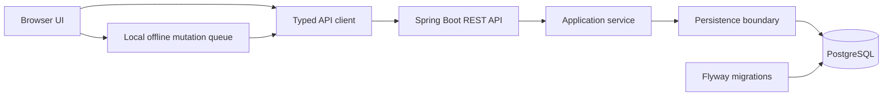

# Architecture

## Purpose and boundary

This repository shows selected engineering patterns from a larger fishing-diary product. It intentionally excludes authentication internals, private-location cryptography, billing, AI cost controls, administration, production networking, deployment scripts, and operational credentials.

## Components

## Request and data flow

1. The frontend creates a validated session command.
2. Its API client sends a relative request to the backend; no environment-specific public endpoint is embedded in the showcase.
3. The controller validates the request and delegates to an application service.
4. The service owns lifecycle rules and persists through a repository interface.
5. A narrow response DTO is returned instead of exposing persistence concerns.
6. When unavailable, the frontend sample stores an opaque mutation locally for later replay. The production reconciliation engine is intentionally not included.

## Backend and frontend

The backend separates web, application, and persistence concerns. The TypeScript/Vite frontend separates domain types, an API adapter, offline state, and a small feature renderer. The product’s complete UI, maps, admin frontend, and private-location flows are not part of this repository.

## Persistence and deployment concept

The broader product uses PostgreSQL and Flyway. The included migration demonstrates the migration-first approach with generic identifiers and no production topology. In the private system, browser and API services are containerized; public deployment configuration is intentionally omitted.
